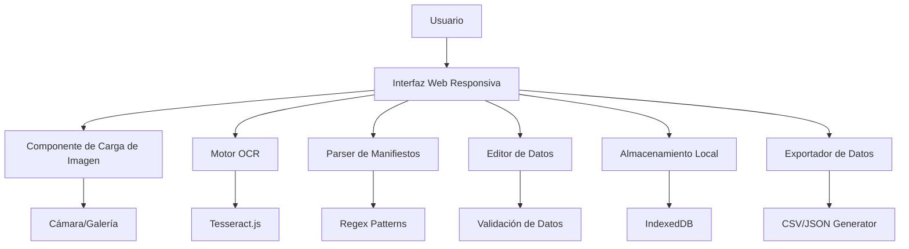

# Documento de Diseño - Escáner de Manifiestos de Salida

## Visión General

La aplicación será una Progressive Web App (PWA) construida con React Native Web que funciona tanto en dispositivos móviles como en computadoras de escritorio. Utilizará tecnologías de OCR basadas en navegador para extraer texto de imágenes de manifiestos aeroportuarios y presentará los datos en una interfaz intuitiva y editable.

## Arquitectura

### Arquitectura de Alto Nivel



### Stack Tecnológico

- **Frontend**: React Native Web (aprovechando el stack existente de Expo)
- **OCR Engine**: Tesseract.js (biblioteca JavaScript para OCR en navegador)
- **Almacenamiento**: IndexedDB a través de expo-sqlite para web
- **Procesamiento de Imágenes**: Canvas API nativo del navegador
- **Exportación**: Bibliotecas nativas de JavaScript para CSV/JSON
- **Responsive Design**: React Native Web con breakpoints personalizados

## Componentes e Interfaces

### 1. Componente Principal (ManifiestoScanner)

```typescript
interface ManifiestoScannerProps {
  onDataExtracted: (data: ManifiestoData) => void;
}

interface ManifiestoData {
  // Información del vuelo
  fecha: string;
  folio: string;
  aeropuertoSalida: string;
  tipoVuelo: string;
  
  // Información de aeronave
  transportista: string;
  equipo: string;
  matricula: string;
  numeroVuelo: string;
  
  // Información del piloto
  pilotoAlMando: string;
  numeroLicencia: string;
  tripulacion: number;
  
  // Movimiento de operaciones
  origenVuelo: string;
  proximaEscala: string;
  destinoVuelo: string;
  horaSlotAsignado: string;
  horaSlotCoordinado: string;
  horaTerminoPernocta: string;
  horaInicioManiobras: string;
  horaSalidaPosicion: string;
  
  // Causa de demora
  causaDemora: string;
  codigoCausa: string;
  
  // Embarque
  pasajeros: PassengerData;
  carga: CargoData;
  
  // Metadatos
  imagenOriginal: string; // Base64
  fechaProcesamiento: Date;
  editado: boolean;
}
```

### 2. Componente de Carga de Imagen (ImageUploader)

```typescript
interface ImageUploaderProps {
  onImageSelected: (imageData: string) => void;
  supportedFormats: string[];
}
```

### 3. Componente OCR (OCRProcessor)

```typescript
interface OCRProcessorProps {
  imageData: string;
  onTextExtracted: (text: string) => void;
  onProgress: (progress: number) => void;
  onError: (error: string) => void;
}
```

### 4. Componente Parser (ManifiestoParser)

```typescript
interface ManifiestoParserProps {
  rawText: string;
  onDataParsed: (data: Partial<ManifiestoData>) => void;
}
```

### 5. Componente Editor de Datos (DataEditor)

```typescript
interface DataEditorProps {
  data: Partial<ManifiestoData>;
  onDataChanged: (updatedData: ManifiestoData) => void;
  validationRules: ValidationRule[];
}
```

## Modelos de Datos

### Estructura de Datos del Manifiesto

```typescript
interface PassengerData {
  nacional: number;
  internacional: number;
  diplomaticos: number;
  enComision: number;
  infantes: number;
  transitos: number;
  conexiones: number;
  otrosExentos: number;
  total: number;
}

interface CargoData {
  equipaje: number; // en kilogramos
  carga: number;    // en kilogramos
  correo: number;   // en kilogramos
  total: number;    // en kilogramos
}

interface ValidationRule {
  field: keyof ManifiestoData;
  required: boolean;
  pattern?: RegExp;
  customValidator?: (value: any) => boolean;
  errorMessage: string;
}
```

### Patrones de Extracción

```typescript
interface ExtractionPattern {
  field: keyof ManifiestoData;
  pattern: RegExp;
  transform?: (match: string) => any;
  fallbackPatterns?: RegExp[];
}
```

## Manejo de Errores

### Estrategia de Manejo de Errores

1. **Errores de Carga de Imagen**
   - Formato no soportado
   - Archivo demasiado grande
   - Imagen corrupta

2. **Errores de OCR**
   - Imagen de baja calidad
   - Texto no legible
   - Timeout de procesamiento

3. **Errores de Parsing**
   - Formato de manifiesto no reconocido
   - Campos obligatorios faltantes
   - Datos inconsistentes

4. **Errores de Almacenamiento**
   - Cuota de almacenamiento excedida
   - Fallo en IndexedDB
   - Datos corruptos

### Implementación de Recuperación

```typescript
interface ErrorRecoveryStrategy {
  errorType: string;
  retryAttempts: number;
  fallbackAction: () => void;
  userNotification: string;
}
```

## Estrategia de Testing

### Pruebas Unitarias

1. **Componente OCR**
   - Pruebas con imágenes de muestra
   - Verificación de precisión de extracción
   - Manejo de errores de OCR

2. **Parser de Manifiestos**
   - Pruebas con diferentes formatos de texto
   - Validación de patrones regex
   - Casos edge con datos faltantes

3. **Validación de Datos**
   - Pruebas de reglas de validación
   - Verificación de campos obligatorios
   - Formato de datos de salida

### Pruebas de Integración

1. **Flujo Completo**
   - Carga de imagen → OCR → Parsing → Edición → Guardado
   - Pruebas en diferentes dispositivos
   - Verificación de responsive design

2. **Almacenamiento**
   - Persistencia de datos
   - Recuperación de sesiones
   - Exportación de datos

### Pruebas de Usuario

1. **Usabilidad**
   - Facilidad de carga de imágenes
   - Claridad de la interfaz de edición
   - Eficiencia del flujo de trabajo

2. **Precisión**
   - Comparación con entrada manual
   - Verificación de datos extraídos
   - Casos de manifiestos reales

## Consideraciones de Rendimiento

### Optimizaciones de OCR

1. **Preprocesamiento de Imagen**
   - Redimensionamiento automático
   - Mejora de contraste
   - Corrección de rotación

2. **Procesamiento Asíncrono**
   - Web Workers para OCR
   - Indicadores de progreso
   - Cancelación de operaciones

### Optimizaciones de Almacenamiento

1. **Compresión de Imágenes**
   - Reducción de calidad para almacenamiento
   - Formatos optimizados (WebP)
   - Limpieza automática de datos antiguos

2. **Gestión de Memoria**
   - Liberación de recursos después del procesamiento
   - Lazy loading de imágenes
   - Paginación de datos históricos

## Seguridad y Privacidad

### Protección de Datos

1. **Almacenamiento Local**
   - Datos sensibles solo en dispositivo del usuario
   - No transmisión a servidores externos
   - Cifrado opcional de datos almacenados

2. **Manejo de Imágenes**
   - Procesamiento completamente local
   - No subida automática a servicios de OCR externos
   - Opción de eliminar imágenes después del procesamiento

### Validación de Entrada

1. **Sanitización de Datos**
   - Validación de formatos de archivo
   - Límites de tamaño de imagen
   - Escape de caracteres especiales en texto extraído

## Arquitectura Responsive

### Breakpoints

```typescript
const breakpoints = {
  mobile: '(max-width: 768px)',
  tablet: '(min-width: 769px) and (max-width: 1024px)',
  desktop: '(min-width: 1025px)'
};
```

### Adaptaciones por Dispositivo

1. **Móvil**
   - Interfaz de una columna
   - Botones grandes para touch
   - Acceso directo a cámara

2. **Tablet**
   - Interfaz de dos columnas
   - Vista dividida imagen/datos
   - Teclado virtual optimizado

3. **Desktop**
   - Interfaz de múltiples columnas
   - Drag & drop para imágenes
   - Atajos de teclado